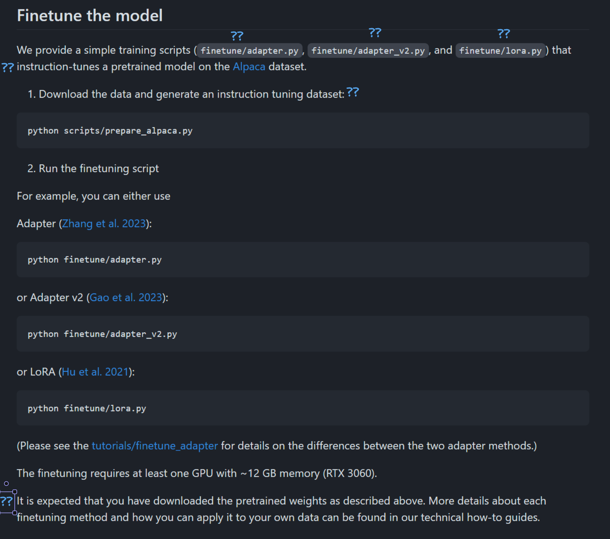
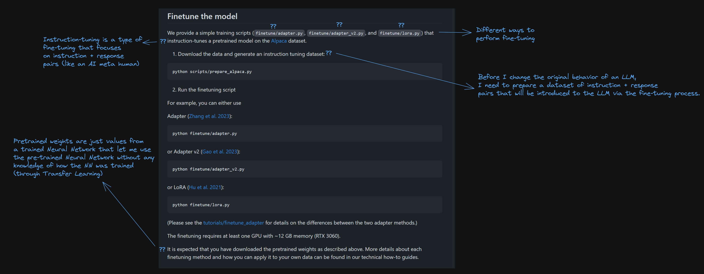
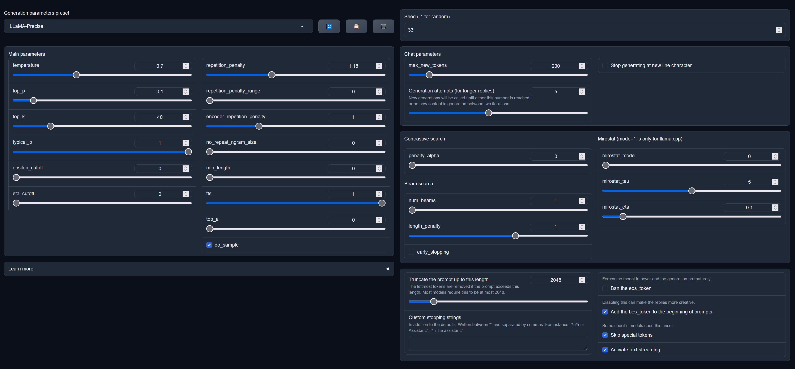
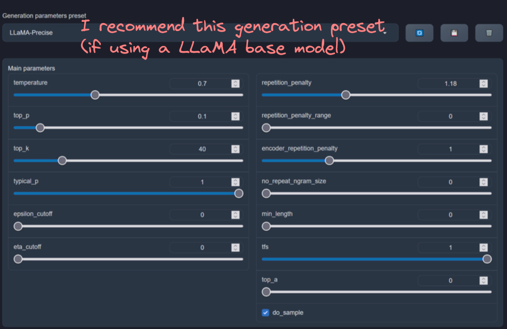
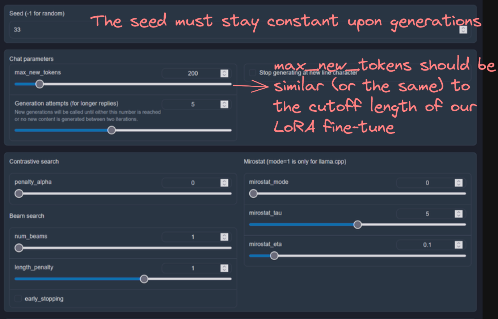
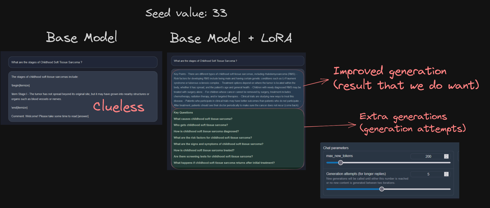

 #LLM Hands-On

These are the resources we will see today.

[Example Medical Dataset](https://github.com/abachaa/MedQuAD)

- Issue: dataset is in XML format
- Solution: build [a parser](../medquad/parse_xml.py) before anything

## Current Problem (July 2023)

Repositories found anywhere in GitHub are highly specialized and require you to understand advanced vocabulary to get started. You also need to know some extra concepts.

For example, I found [this repository](https://github.com/Lightning-AI/lit-gpt) (which is great and lets people get started with LLMs). But, it's not 100% clear how to get started. It's not their fault, as they develop code that needs to be very well documented for highly specialized people that will use this product in their professional lives.

It's our job to understand the terminologies and adapt to the technical vocabulary. I'll do my best to facilitate that.

Going back to the `lit-gpt` example, looking at the fine-tuning chapter:


> **Note**: I've added some question marks where some friends of mine got lost while I was explaining what fine-tuning is.

Now, I've edited the above picture and added some initial remarks:



There's also the need to run Python scripts with various parameters that may sound completely new for people hopping into LLMs. Some of them are industry-agnostic (for example, some concepts like hyperparameters, NNs, transfer learning are also common in other AI industries like Computer Vision).

This, together with finding a repository with a lot of code in it, may deter or scare off people that might think this is too hard for them.

I don't think that's the case, so let's get started.


## Useful Repositories

We will use GUI-based repositories to perform fine-tuning. That will eliminate the need to run the Python scripts yourself with args and remove some of the complexity from the process. This will also let us focus on understanding what goes on without necessarily getting tunnel vision on the complexity of the underlying code.

However, if you're looking for documentation that explains how to perform fine-tuning the CLI way (with scripts), have a look at `lit-gpt`'s official docs:

- [Finetuning with Adapters](https://github.com/Lightning-AI/lit-gpt/blob/main/tutorials/finetune_adapter.md)
- [Finetuning with LoRA](https://github.com/Lightning-AI/lit-gpt/blob/main/tutorials/finetune_lora.md)

And now, the repositories that we'll use:

- [oobabooga's webui](https://github.com/oobabooga/text-generation-webui) (16.8k stars), to perform fine-tuning
- [zetavg's LLaMA-LoRA-Tuner](https://github.com/zetavg/LLaMA-LoRA-Tuner) (263 stars) (dev branch), to stochastically test fine-tuning after it's done and check results.

I've set up my GPU instance in OCI and downloaded both repositories (with their respective dependencies). Then, I go to my webui.

These are the commands to execute:

```bash
conda create -n textgen python=3.10.9 # create a new conda env
conda activate textgen # activate my env
conda init bash # initialize my new conda env as bash
nvidia-smi # check if everything is installed
conda activate textgen # activate it after initialization
git clone https://github.com/oobabooga/text-generation-webui # if you haven't already
cd text-generation-webui
pip install -r requirements.txt # make sure to install the requirements in the new env
conda install -c conda-forge cudatoolkit-dev
mkdir repositories # (optional) create a new repo for quantized LLaMA
cd repositories # (optional)
git clone https://github.com/oobabooga/GPTQ-for-LLaMa.git -b cuda # (optional)
cd GPTQ-for-LLaMa # (optional)
python setup_cuda.py install # (optional) setup the new repo
cd ..
python download-model.py Neko-Institute-of-Science/LLaMA-7B-HF # download a base LLaMA model from Huggingface ('user/repo' format in Huggingface)
python server.py --auto-devices --model-menu --load-in-8bit # run the gradio server locally to get access to the GUI
```

## LoRA or Low Rank Adaptation

An important paradigm of natural language processing consists of large-scale pre-training on general domain data and adaptation to particular tasks or domains.

As we pre-train larger models, full fine-tuning, which retrains all model parameters, becomes less feasible. Using GPT-3 175B as an example -- deploying independent instances of fine-tuned models, each with 175B parameters, is prohibitively expensive.

Low-Rank Adaptation, or LoRA, freezes the pre-trained model weights and injects trainable rank decomposition matrices into each layer of the Transformer architecture, greatly reducing the number of trainable parameters for downstream tasks.

Compared to GPT-3 175B fine-tuned with Adam, LoRA can reduce the number of trainable parameters by **10,000 times** and the GPU memory requirement (RAM) by **3 times**.

## text-generation-webui

The WebUI seeks to make training your own LoRAs as easy as possible. It comes down to just a few simple steps:

### **Step 1**: Make a plan.
- What base model do you want to use? The LoRA you make has to be matched up to a single architecture (eg LLaMA-13B) and cannot be transferred to others (eg LLaMA-7B, StableLM, etc. would all be different). Derivatives of the same model (eg Alpaca finetune of LLaMA-13B) might be transferrable, but even then it's best to train exactly on what you plan to use.
- What model format do you want? At time of writing, 8-bit models are most stable, and 4-bit are supported but experimental. In the near future it is likely that 4-bit will be the best option for most users.
- What are you training it on? Do you want it to learn real information, a simple format, ...?

### **Step 2**: Gather a dataset.
- If you use a dataset similar to the [Alpaca](https://github.com/gururise/AlpacaDataCleaned/blob/main/alpaca_data_cleaned.json) format, that is natively supported by the `Formatted Dataset` input in the WebUI, with premade formatter options.
- If you use a dataset that isn't matched to Alpaca's format, but uses the same basic JSON structure, you can make your own format file by copying `training/formats/alpaca-format.json` to a new file and [editing its content](#format-files).
- If you can get the dataset into a simple text file, that works too! You can train using the `Raw text file` input option.
    - This means you can for example just copy/paste a chatlog/documentation page/whatever you want, shove it in a plain text file, and train on it.
- If you use a structured dataset not in this format, you may have to find an external way to convert it - or open an issue to request native support.

### **Step 3**: Do the training.
- **3.1**: Load the WebUI, and your model.
    - Make sure you don't have any LoRAs already loaded (unless you want to train for multi-LoRA usage).
- **3.2**: Open the `Training` tab at the top, `Train LoRA` sub-tab.
- **3.3**: Fill in the name of the LoRA, select your dataset in the dataset options.
- **3.4**: Select other parameters to your preference. See [parameters below](#parameters).
- **3.5**: click `Start LoRA Training`, and wait.
    - It can take a few hours for a large dataset, or just a few minute if doing a small run.
    - You may want to monitor your [loss value](#loss) while it goes.

### **Step 4**: Evaluate your results.
- Load the LoRA under the Models Tab.
- You can go test-drive it on the `Text generation` tab, or you can use the `Perplexity evaluation` sub-tab of the `Training` tab.
- If you used the `Save every n steps` option, you can grab prior copies of the model from sub-folders within the LoRA model's folder and try them instead.

### **Step 5**: Re-run if you're unhappy.
- Make sure to unload the LoRA before training it.
- You can simply resume a prior run - use `Copy parameters from` to select your LoRA, and edit parameters. Note that you cannot change the `Rank` of an already created LoRA.
    - If you want to resume from a checkpoint saved along the way, simply copy the contents of the checkpoint folder into the LoRA's folder.
    - (Note: `adapter_model.bin` is the important file that holds the actual LoRA content).
    - This will start Learning Rate and Steps back to the start. If you want to resume as if you were midway through, you can adjust your Learning Rate to the last reported LR in logs and reduce your epochs.
- Or, you can start over entirely if you prefer.
- If your model is producing corrupted outputs, you probably need to start over and use a lower Learning Rate.
- If your model isn't learning detailed information but you want it to, you might need to just run more epochs, or you might need a higher Rank.
- If your model is enforcing a format you didn't want, you may need to tweak your dataset, or start over and not train as far.

## Testing Base Model vs. Base Model + LoRA

To test whether the LoRA has made any impact into the base model, we need to run some generations with both. But how do we make sure if the LoRA is effective?

Let's briefly look at the 'Generation parameters' tab:



In order to check (in a kind-of manual way) the difference in results, we will need to change some parameters:





Note that the seed value must stay constant in-between generations so that we can check the effectiveness of the fine-tuning process into the base model. Now, we have a completely new fine-tuned model, with a new adapted behavior into the kind of question + answers we want to create.

The reason why this behavior has been possible to implement is because:
- The base model is sufficiently large, so that it's learned about (English) syntax and word structures inherently, and adding new (English) structured Q&A pairs doesn't alter its behavior
- LoRA only takes about 1%-0.001% of the base model's parameters and only modifies the behavior of those trainable parameters
- We have provided enough (I reckon a couple of hundred Q&A pairs, although this may depend on the base model size and # of params) examples / instruction-response pairs in our LoRA dataset, which has altered the generation behavior enough.

Now, here's an example between making a generation (from the original LoRA dataset we prepared), only with the base model, vs. using the base model + our LoRA file:



## Extra Resource: Quantized Finetuning (8-bit or 4-bit)

Under the hood, the Python code will convert tensor values from the trainable rank decomposition matrices from 32bit representation into to 8bit for efficient, slightly less accurate finetuning.

In extreme cases (like mine), where I use a 7 billion parameter model (which is not a lot, but still not enough for my GPU), 4-bit quantization is what we'll apply.

Again, by wrapping 32-bit values into 4-bit, we will lose floating point precision in our rank decomposition matrices, and these parameters will carry over some errors, but I found that 7B parameter base models behave well with 8-bit and 4-bit quantization with the amount of LoRA data I provided.

Quantization, therefore, is very necessary, as even models that look like they are the smallest out there (like LLaMA-7B (7 billion parameters)) are in reality too big to even train in 4-bit mode on 24GB of VRAM. So, we really need a LOT of compute resources if we want to apply fine-tuning.

This technique is very State of the art, so there aren't **a lot** of people who have experimented with quantized fine-tuning yet. But, in theory, this should at some point allow LLMs to be trained, or at least fine-tuned, using CPUs or commodity hardware and avoid such high carbon footprints.

[QLoRA](https://github.com/artidoro/qlora) (Quantized LoRA)

## Annex: More LLM Datasets

| Dataset Name                                                                                                           | Size | Languages                                                          | Source                                                                                                                                                                                                                                | License                                                                                                                                                                                                            |
|------------------------------------------------------------------------------------------------------------------------|------|--------------------------------------------------------------------|---------------------------------------------------------------------------------------------------------------------------------------------------------------------------------------------------------------------------------------|--------------------------------------------------------------------------------------------------------------------------------------------------------------------------------------------------------------------|
| [lima](https://huggingface.co/datasets/GAIR/lima)                                                                      | 1K   | English                                                            | LIMA: Less Is More for Alignment                                                                                                                                                                                                      | CC BY-NC-SA                                                                                                                                                                                                        |
| [im-feeling-curious](https://huggingface.co/datasets/xiyuez/im-feeling-curious)                                        | 3K   | English                                                            | This public dataset is an extract from Google's "i'm feeling curious" feature. To learn more about this feature, search for "i'm feeling curious" on Google.                                                                          | -                                                                                                                                                                                                                  |
| [cc_sbu_align](https://huggingface.co/datasets/Vision-CAIR/cc_sbu_align)                                               | 4K   | English                                                            | MiniGPT-4  datadset                                                                                                                                                                                                                   | BSD 3-Clause License                                                                                                                                                                                               |
| [SLF5K](https://huggingface.co/datasets/JeremyAlain/SLF5K)                                                             | 5K   | English                                                            | The Summarization with Language Feedback (SLF5K) dataset is an English-language dataset containing 5K unique samples that can be used for the task of abstraction summarization.                                                      | apache-2.0                                                                                                                                                                                                         |
| [blended_skill_talk](https://huggingface.co/datasets/blended_skill_talk)                                               | 7K   | English                                                            | A dataset of 7k conversations explicitly designed to exhibit multiple conversation modes: displaying personality, having empathy, and demonstrating knowledge.                                                                        | -                                                                                                                                                                                                                  |
| [GSM-IC](https://github.com/google-research-datasets/GSM-IC)                                                           | 8K   | English                                                            | Grade-School Math with Irrelevant Context (GSM-IC)                                                                                                                                                                                    | -                                                                                                                                                                                                                  |
| [ChatAlpaca](https://github.com/cascip/ChatAlpaca)                                                                     | 10K  | English                                                            | The data currently contain a total of 10,000 conversations with 95,558 utterances.                                                                                                                                                    | Apache-2.0 license                                                                                                                                                                                                 |
| [PKU-SafeRLHF-10K](https://huggingface.co/datasets/PKU-Alignment/PKU-SafeRLHF-10K)                                     | 10K  | English                                                            | PKU-SafeRLHF-10K, which is the first dataset of its kind and contains 10k instances with safety preferences.                                                                                                                          | -                                                                                                                                                                                                                  |
| [Dolly](https://github.com/databrickslabs/dolly/tree/master/data)                                                      | 15K  | English                                                            | databricks-dolly-15k is a corpus of more than 15,000 records generated by thousands of Databricks employees to enable large language models to exhibit the magical interactivity of ChatGPT.                                          | CC 3.0                                                                                                                                                                                                             |
| [WebGPT](https://huggingface.co/datasets/openai/webgpt_comparisons)                                                    | 20K  | English                                                            | This is the dataset of all comparisons that were marked as suitable for reward modeling by the end of the WebGPT project.                                                                                                             | -                                                                                                                                                                                                                  |
| [Code Alpaca](https://github.com/sahil280114/codealpaca)                                                               | 20K  | English                                                            | Code generation task involving 20,022 samples                                                                                                                                                                                         | -                                                                                                                                                                                                                  |
| [LongForm](https://github.com/akoksal/LongForm/tree/main/dataset)                                                      | 28K  | English                                                            | The LongForm dataset is created by leveraging English corpus examples with augmented instructions.                                                                                                                                    | The LongForm project is subject to a MIT License with custom limitations for restrictions imposed by OpenAI (for the instruction generation part), as well as the license of language models (OPT, LLaMA, and T5). |
| [HC3](https://huggingface.co/datasets/Hello-SimpleAI/HC3)                                                              | 37K  | English, Chinese                                                   | 37,175 instructions generated by ChatGPT and human                                                                                                                                                                                    | -                                                                                                                                                                                                                  |
| [RefGPT](https://github.com/ziliwangnlp/RefGPT)                                                                        | 50K  | English,chinese                                                    | we introduce a cost-effective method called RefGPT, which generates a vast amount of high-quality multi-turn Q&A content.                                                                                                             | -                                                                                                                                                                                                                  |
| [arxiv-math-instruct-50k](https://huggingface.co/datasets/ArtifactAI/arxiv-math-instruct-50k)                          | 50K  | English                                                            | Dataset consists of question-answer pairs derived from ArXiv abstracts from math categories                                                                                                                                           | -                                                                                                                                                                                                                  |
| [Traditional Chinese Alpaca Dataset](https://github.com/ntunlplab/traditional-chinese-alpaca)                          | 52K  | Traditional Chinese                                                | Translated from Alpaca Data by ChatGPT API                                                                                                                                                                                            | Apache-2.0 license                                                                                                                                                                                                 |
| [Cabrita Dataset](https://github.com/22-hours/cabrita)                                                                 | 52K  | Portuguese                                                         | Translated from Alpaca Data                                                                                                                                                                                                           |                                                                                                                                                                                                                    |
| [Japanese Alpaca Dataset](https://github.com/shi3z/alpaca_ja)                                                          | 52K  | Japanese                                                           | Translated from Alpaca Data by ChatGPT API                                                                                                                                                                                            | CC By NC 4.0; OpenAI terms of use                                                                                                                                                                                  |
| [Alpaca Dataset](https://github.com/tatsu-lab/stanford_alpaca)                                                         | 52K  | English                                                            | 175 seed instructions by OpenAI API                                                                                                                                                                                                   | CC By NC 4.0; OpenAI terms of use                                                                                                                                                                                  |
| [Alpaca Data Cleaned](https://github.com/gururise/AlpacaDataCleaned)                                                   | 52K  | English                                                            | Revised version of Alpaca Dataset                                                                                                                                                                                                     | -                                                                                                                                                                                                                  |
| [Alpaca GPT-4 Data](https://github.com/Instruction-Tuning-with-GPT-4/GPT-4-LLM)                                        | 52K  | English                                                            | Generated by GPT-4 using Alpaca prompts                                                                                                                                                                                               | -                                                                                                                                                                                                                  |
| [Alpaca GPT-4 Data (Chinese)](https://github.com/Instruction-Tuning-with-GPT-4/GPT-4-LLM)                              | 52K  | Chinese                                                            | Generated by GPT-4 using Chinese prompts translated from Alpaca by ChatGPT                                                                                                                                                            | -                                                                                                                                                                                                                  |
| [Dynosaur](https://dynosaur-it.github.io)                                                                              | 66K  | English                                                            | Dynosaur, a dynamic growth paradigm for instruction-tuning data curation.                                                                                                                                                             | Apache-2.0 license                                                                                                                                                                                                 |
| [Finance](https://huggingface.co/datasets/gbharti/finance-alpaca)                                                      | 69K  | English                                                            | 68,912 financial related instructions                                                                                                                                                                                                 | -                                                                                                                                                                                                                  |
| [evol](https://huggingface.co/datasets/WizardLM/WizardLM_evol_instruct_70k)                                            | 70K  | English                                                            | This is the training data of WizardLM.                                                                                                                                                                                                | -                                                                                                                                                                                                                  |
| [Vicuna Dataset](https://huggingface.co/datasets/anon8231489123/ShareGPT_Vicuna_unfiltered)                            | 75K  | English                                                            | ~100k ShareGPT conversations                                                                                                                                                                                                          | -                                                                                                                                                                                                                  |
| [InstructionTranslation](https://huggingface.co/datasets/theblackcat102/instruction_translations)                      | 80K  | Multi-lingual                                                      | Translations were generated by M2M 12B and the output generations were limited at 512 tokens due to VRAM limit (40G).                                                                                                                 | MIT                                                                                                                                                                                                                |
| [Self-Instruct](https://github.com/yizhongw/self-instruct/tree/main)                                                   | 82K  | English                                                            | We release a dataset that contains 52k instructions, paired with 82K instance inputs and outputs.                                                                                                                                     | -                                                                                                                                                                                                                  |
| [OASST1](https://huggingface.co/datasets/OpenAssistant/oasst1)                                                         | 89K  | Multi-lingual                                                      | a human-generated, human-annotated assistant-style conversation corpus consisting of 161,443 messages in 35 different languages, annotated with 461,292 quality ratings, resulting in over 10,000 fully annotated conversation trees. | apache-2.0                                                                                                                                                                                                         |
| [HH-RLHF](https://github.com/anthropics/hh-rlhf/tree/master)                                                           | 91K  | English                                                            | The data are described in the paper: Training a Helpful and Harmless Assistant with Reinforcement Learning from Human Feedback.                                                                                                       | MIT                                                                                                                                                                                                                |
| [Guanaco Dataset](https://huggingface.co/datasets/JosephusCheung/GuanacoDataset)                                       | 98K  | English, Simplified Chinese, Traditional Chinese HK & TW, Japanese | 175 tasks from the Alpaca model                                                                                                                                                                                                       | GPLv3                                                                                                                                                                                                              |
| [InstructionWild](https://github.com/XueFuzhao/InstructionWild)                                                        | 104K | English, Chinese                                                   | 429 seed instructions and follow Alpaca to generate 52K                                                                                                                                                                               | Research only; OpenAI terms of use                                                                                                                                                                                 |
| [Camel Dataset](https://github.com/lightaime/camel)                                                                    | 107K | Multi-lingual                                                      | Role-playing between AIs (Open AI API)                                                                                                                                                                                                | -                                                                                                                                                                                                                  |
| [tapir-cleaned-116k](https://huggingface.co/datasets/MattiaL/tapir-cleaned-116k)                                       | 116K | English                                                            | This is a revised version of the DAISLab dataset of IFTTT rules, which has been thoroughly cleaned, scored, and adjusted for the purpose of instruction-tuning.                                                                       | cc-by-nc-4.0                                                                                                                                                                                                       |
| [Tapir-Cleaned](https://huggingface.co/datasets/MattiaL/tapir-cleaned-116k)                                            | 117K | English                                                            | This is a revised version of the DAISLab dataset of IFTTT rules, which has been thoroughly cleaned, scored, and adjusted for the purpose of instruction-tuning.                                                                       | CC BY-NC 4.0                                                                                                                                                                                                       |
| [WizardLM_evol_instruct_V2_196k](https://huggingface.co/datasets/WizardLM/WizardLM_evol_instruct_V2_196k)              | 143K | English                                                            | This datasets contains 143K mixture evolved data of Alpaca and ShareGPT.                                                                                                                                                              | -                                                                                                                                                                                                                  |
| [LLaVA Visual Instruct](https://huggingface.co/datasets/liuhaotian/LLaVA-Instruct-150K)                                | 150K | English                                                            | LLaVA Visual Instruct 150K is a set of GPT-generated multimodal instruction-following data. It is constructed for visual instruction tuning and for building large multimodal towards GPT-4 vision/language capability.               | cc-by-nc-4.0                                                                                                                                                                                                       |
| [Prosocial Dialog](https://huggingface.co/datasets/allenai/prosocial-dialog)                                           | 166K | English                                                            | 165,681 instructions produced by GPT-3 rewrites questions and human feedback                                                                                                                                                          | -                                                                                                                                                                                                                  |
| [COIG](https://huggingface.co/datasets/BAAI/COIG)                                                                      | 191K | Chinese                                                            | Chinese Open Instruction Generalist (COIG) project to maintain a harmless, helpful, and diverse set of Chinese instruction corpora.                                                                                                   | apache-2.0                                                                                                                                                                                                         |
| [Unnatural Instructions](https://github.com/orhonovich/unnatural-instructions)                                         | 241K | English                                                            | a large dataset of cre- ative and diverse instructions, collected with virtually no human labor.                                                                                                                                      | MIT                                                                                                                                                                                                                |
| [SHP](https://huggingface.co/datasets/stanfordnlp/SHP)                                                                 | 358K | English                                                            | SHP is a dataset of 385K collective human preferences over responses to questions/instructions in 18 different subject areas, from cooking to legal advice.                                                                           | Reddit non-exclusive, non-transferable, non-sublicensable, and revocable license                                                                                                                                   |
| [ultrachat](https://huggingface.co/datasets/stingning/ultrachat)                                                       | 404K | English                                                            | To ensure generation quality, two separate ChatGPT Turbo APIs are adopted in generation, where one plays the role of the user to generate queries and the other generates the response.                                               | cc-by-nc-4.0                                                                                                                                                                                                       |
| [ign_clean_instruct_dataset_500k](https://huggingface.co/datasets/ignmilton/ign_clean_instruct_dataset_500k)           | 509K | English                                                            | This dataset contains ~508k prompt-instruction pairs with high quality responses. It was synthetically created from a subset of Ultrachat prompts. It does not contain any alignment focused responses or NSFW content.               | apache-2.0                                                                                                                                                                                                         |
| [ELI5](https://huggingface.co/datasets/eli5)                                                                           | 559K | English                                                            | The ELI5 dataset is an English-language dataset of questions and answers gathered from three subreddits where users ask factual questions requiring paragraph-length or longer answers.                                               | -                                                                                                                                                                                                                  |
| [GPT4All Dataset](https://github.com/nomic-ai/gpt4all)                                                                 | 806K | Multi-lingual                                                      | Subset of LAION OIG, StackOverflow Question, BigSciense/p3 dataset. Answered by OpenAI API.                                                                                                                                           | -                                                                                                                                                                                                                  |
| [Instruct](https://huggingface.co/datasets/swype/instruct)                                                             | 889K | English                                                            | 888,969 English instructions, augmentation using AllenAI NLP tools                                                                                                                                                                    | MIT                                                                                                                                                                                                                |
| [MOSS](https://github.com/OpenLMLab/MOSS#数据)                                                                           | 1M   | Chinese                                                            | Generated by gpt-3.5-turbo                                                                                                                                                                                                            | Apache-2.0, AGPL-3.0 licenses                                                                                                                                                                                      |
| [LaMini-Instruction](https://huggingface.co/datasets/MBZUAI/LaMini-instruction)                                        | 3M   | English                                                            | a total of 2.58M pairs of instructions and responses using gpt-3.5-turbo based on several existing resources of prompts                                                                                                               | cc-by-nc-4.0                                                                                                                                                                                                       |
| [Natural Instructions](https://github.com/allenai/natural-instructions)                                                | 5M   | Multi-lingual                                                      | 5,040,134 instructions collected from diverse NLP tasks                                                                                                                                                                               | -                                                                                                                                                                                                                  |
| [BELLE](https://github.com/LianjiaTech/BELLE/tree/main/data)                                                           | 10M  | Chinese                                                            | The 10M Chinese dataset is composed of subsets spanning multiple (instruction) types and multiple fields.                                                                                                                             | Research only; OpenAI terms of use                                                                                                                                                                                 |
| [Firefly](https://github.com/yangjianxin1/Firefly)                                                                     | 16M  | Chinese                                                            | 1,649,398 Chinese instructions in 23 NLP tasks                                                                                                                                                                                        | -                                                                                                                                                                                                                  |
| [OIG-43M Dataset](https://laion.ai/blog/oig-dataset/)                                                                  | 43M  | Multi-lingual                                                      | Together, LAION, and Ontocord.ai.                                                                                                                                                                                                     | -                                                                                                                                                                                                                  |
| [xP3](https://huggingface.co/datasets/bigscience/xP3)                                                                  | 79M  | Multi-lingual                                                      | 78,883,588 instructions collected by prompts & datasets across 46 languages & 16 NLP tasks                                                                                                                                            | -                                                                                                                                                                                                                  |
| [CodeParrot](https://github.com/huggingface/transformers/tree/main/examples/research_projects/codeparrot#dataset)      | -    | python                                                             | The database was queried for all Python files with less than 1MB in size resulting in a 180GB dataset with over 20M files.                                                                                                            | -                                                                                                                                                                                                                  |
| [Alpaca-CoT Dataset](https://github.com/PhoebusSi/Alpaca-CoT/tree/main/data)                                           | -    | Multi-lingual                                                      | Instruction Data Collection                                                                                                                                                                                                           | ODC-By                                                                                                                                                                                                             |
| [stack-exchange-paired](https://huggingface.co/datasets/lvwerra/stack-exchange-paired)                                 | -    | English                                                            | This dataset contains questions and answers from the Stack Overflow Data Dump for the purpose of preference model training.                                                                                                           | cc-by-sa-4.0                                                                                                                                                                                                       |
| [LangChainDatasets](https://huggingface.co/LangChainDatasets)                                                          | -    | English                                                            | This is a community-drive dataset repository for datasets that can be used to evaluate LangChain chains and agents.                                                                                                                   | -                                                                                                                                                                                                                  |
| [ParlAI](https://github.com/facebookresearch/ParlAI/tree/main/parlai/tasks)                                            | -    | English                                                            | 100+ popular datasets available all in one place, dialogue models, from open-domain chitchat, to task-oriented dialogue, to visual question answering.                                                                                | -                                                                                                                                                                                                                  |
| [GPTeacher](https://github.com/teknium1/GPTeacher)                                                                     | -    | English                                                            | A collection of modular datasets generated by GPT-4, General-Instruct - Roleplay-Instruct - Code-Instruct - and Toolformer                                                                                                            | -                                                                                                                                                                                                                  |
| [silk-road/Wizard-LM-Chinese-instruct-evol](https://huggingface.co/datasets/silk-road/Wizard-LM-Chinese-instruct-evol) | -    | chinese                                                            | Wizard-LM-Chinese                                                                                                                                                                                                                     | -                                                                                                                                                                                                                  |
                                 |
